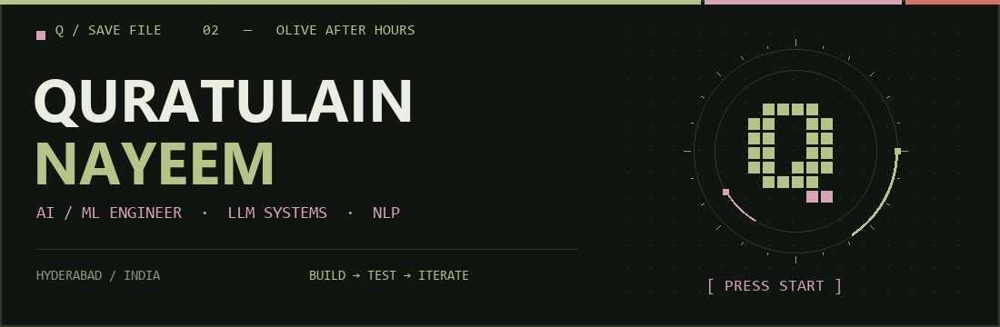

<h1>Quratulain Nayeem</h1>

<strong>AI/ML Engineer · LLM Systems · Natural Language Processing</strong>

<strong>I build AI tools for the part before a decision.</strong>

What to watch. Where to build. Who to shortlist. How an idea becomes a system.

Based in Hyderabad, India. B.E. Computer Science (AI &amp; ML), MJCET, graduating 2027. I build multi-agent pipelines, semantic search and ranking systems, and deployed AI web applications.

<a href="https://portfolio-updated-rose-pi.vercel.app/">[ enter portfolio ]</a> &nbsp;
<a href="https://portfolio-updated-rose-pi.vercel.app/resume.pdf">[ read CV ]</a> &nbsp;
<a href="https://www.linkedin.com/in/quratulain-nayeem/">[ LinkedIn ]</a> &nbsp;
<a href="mailto:quratulainnayeem@gmail.com">[ contact ]</a>

<h2>01 / Selected AI &amp; Machine Learning Projects</h2>

<samp>CHOOSE A PROBLEM. INSPECT THE BUILD.</samp>

<table>
<tr>
<td width="50%" valign="top">

<h3>Compyl</h3>

<strong>Give an idea a structure.</strong>

An LLM compiler: plain English → validated UI, API, database and auth schemas. Four stages, with targeted repair for cross-layer inconsistencies.

<strong>Build log:</strong> 15/16 prompts passed on the first attempt in the project's evaluation; 44/46 detected errors repaired.

<code>FastAPI</code> <code>Pydantic</code> <code>LLaMA / Groq</code>

<a href="https://huggingface.co/spaces/quratulainnnnn/compyl">Launch ↗</a> &nbsp; <a href="https://github.com/quratulain-nayeem/Compyl">Inspect code ↗</a>

</td>
<td width="50%" valign="top">

<h3>WatchWorthy</h3>

<strong>Before you spend 40 minutes watching.</strong>

A YouTube tutorial evaluator combining engagement, comment classification and transcript signals, with transcript-grounded Q&amp;A.

<strong>Build log:</strong> Web app and companion Chrome extension; recommendations filtered for relevance to the analyzed video.

<code>Python</code> <code>FastAPI</code> <code>Transformers</code>

<a href="https://huggingface.co/spaces/quratulainnnnn/WatchWorthy">Launch ↗</a> &nbsp; <a href="https://github.com/quratulain-nayeem/WatchWorthy">Inspect code ↗</a>

</td>
</tr>
<tr>
<td width="50%" valign="top">

<h3>KhojAPI</h3>

<strong>Read the neighbourhood before opening shop.</strong>

Turns Google Places data and customer reviews into complaint patterns, competition density and underserved price-band signals.

<strong>Build log:</strong> Three-agent pipeline with asynchronous jobs, pollable status and reports persisted to SQLite.

<code>FastAPI</code> <code>Groq</code> <code>VADER</code> <code>Docker</code>

<a href="https://huggingface.co/spaces/quratulainnnnn/khojAPI">Launch ↗</a> &nbsp; <a href="https://github.com/quratulain-nayeem/khojAPI">Inspect code ↗</a>

</td>
<td width="50%" valign="top">

<h3>Intelligent Candidate Discovery</h3>

<strong>100,000 profiles. A shortlist of 100.</strong>

A candidate-ranking challenge submission combining FAISS semantic retrieval with signals for skills, experience and evidence of production work.

<strong>Build log:</strong> Local ranking without API calls; outputs a top-100 CSV and score explanations.

<code>Python</code> <code>Sentence Transformers</code> <code>FAISS</code>

<a href="https://github.com/quratulain-nayeem/Intelligent-candidate-discovery">Inspect pipeline ↗</a>

</td>
</tr>
</table>

<strong>Also in the inventory</strong> 
<a href="https://github.com/quratulain-nayeem/NLP-project-">Review Intelligence</a> — 121 topics from a 10,000-review modeling sample drawn from 568,454 Amazon reviews. 
<a href="https://claro-eta.vercel.app/">Claro</a> — drag-and-drop Kanban, deadlines and a monthly planner. No login required.

<h2>02 / Technical Skills &amp; Loadout</h2>

<strong>Systems</strong> &nbsp; Python · FastAPI · Pydantic · Docker · SQL 
<strong>Intelligence</strong> &nbsp; PyTorch · Transformers · FAISS · BERTopic · Groq 
<strong>Interfaces</strong> &nbsp; React · Next.js · Streamlit 
<strong>Other worlds</strong> &nbsp; Unity · C#

<strong>03 / AI Research Log</strong> — open dossiers

 

B.E. Computer Science (AI &amp; ML), MJCET · 2023–2027 · CGPA 8.5. 
IEEE CIS Research Head, September 2025–September 2026; mentored 10+ members in ML research methodology.

<strong>Manuscripts under review:</strong>

<ul>
<li>Cross-dataset intrusion detection with a hybrid Autoencoder–Transformer and SHAP explainability.</li>
<li>Human vs. LLM-generated Sigma detection rules under adversarial evasion — solo author.</li>
<li>LAF-YOLOv10 for small-object detection in drone imagery.</li>
</ul>

<a href="https://portfolio-updated-rose-pi.vercel.app/">Explore the research on my portfolio ↗</a>

 

<strong>04 / Side quest</strong> — something is behind this door

 

I also designed a first-person psychological horror game in Unity with custom puzzle mechanics, as part of my GDGC Game Dev work.

Sometimes the output is a useful answer. Sometimes it is a very uncomfortable room.

<a href="https://github.com/quratulain-nayeem/tile-palace">A different save file: my 2D Unity platformer ↗</a>

<samp>CO-OP / START A CONVERSATION</samp>

<strong>Working on an AI product? Send me the problem.</strong>

<a href="mailto:quratulainnayeem@gmail.com">quratulainnayeem@gmail.com</a>

Ask me about the pipeline. Or the puzzle mechanics.

